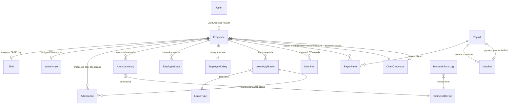
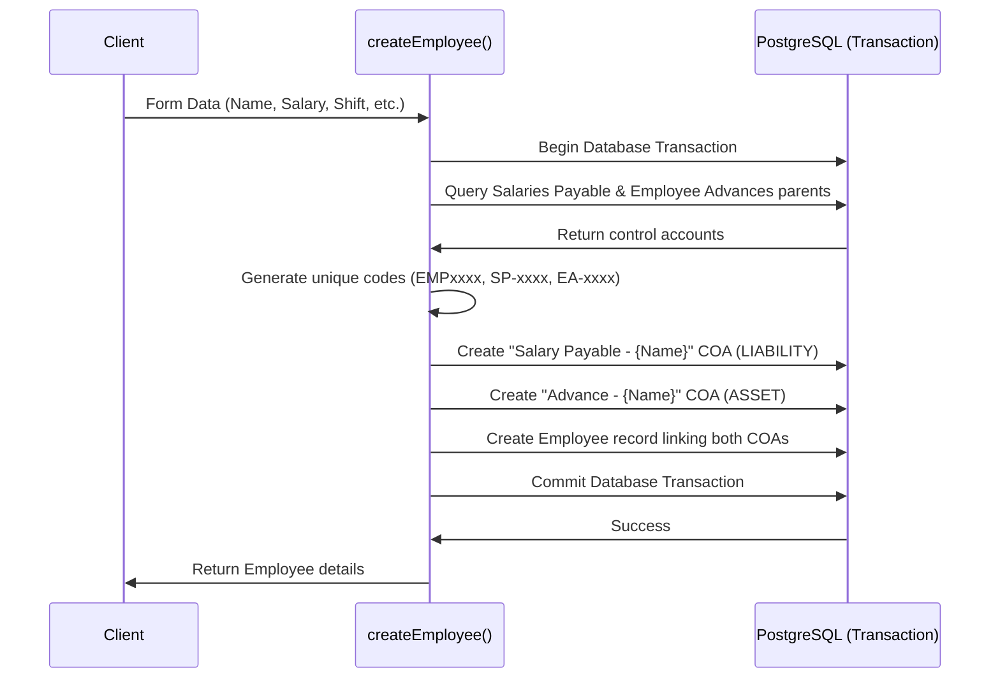
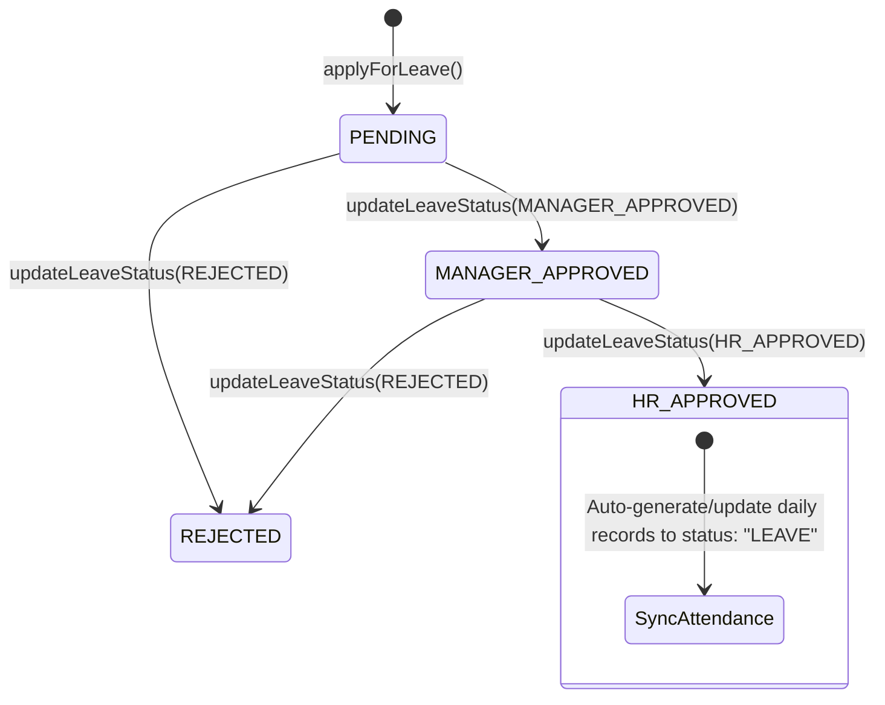
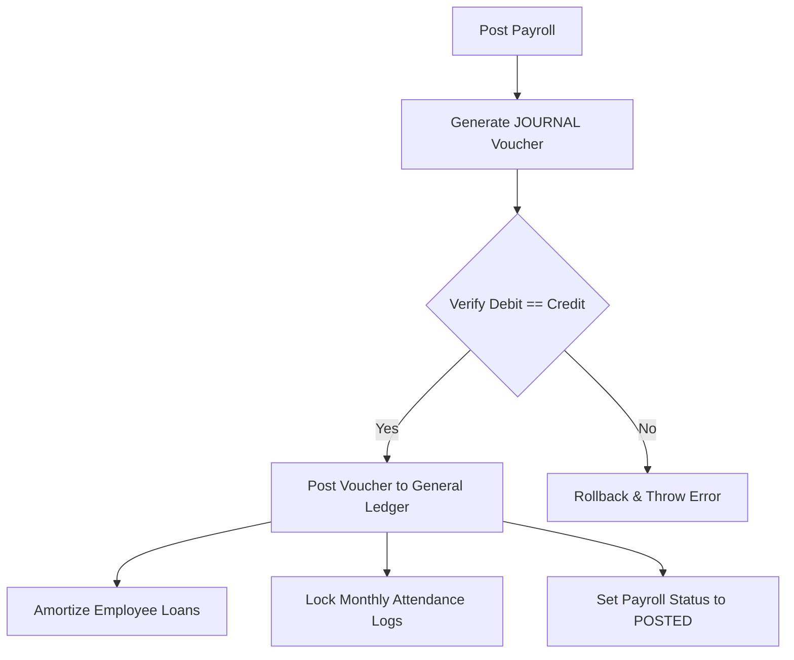

# Human Resource Management System (HRMS) - Developer Reference

**Date**: May 2026  
**Purpose**: Comprehensive technical overview, database schema representation, workflow patterns, and integration specifications for the HR & Payroll modules.  
**Target Audience**: Backend and Frontend Developers, System Architects, and QA Engineers.

---

## 1. Architectural Overview

The HR & Payroll System (HRMS) is a modular sub-system within the ERP platform. It manages the complete employee lifecycle, shift scheduling, leave tracking, biometric attendance capture, and automated payroll generation with double-entry accounting integration.

The codebase is split into two primary areas in the Next.js directory tree:
1. **Employees Master Directory**: `/app/(dashboard)/dashboard/employees`
   - Handles onboarding, personal records, and financial account linkages.
2. **HR Operations Directory**: `/app/(dashboard)/dashboard/hr`
   - Divided into 7 distinct domains:
     - `attendance`: Biometric and manual punch logs, sync records, device settings.
     - `calendar`: Master holiday list and factory calendars.
     - `holidays`: CRUD operations for holidays (warehouse/branch level).
     - `leave`: Leave category setup, employee balance queries, approval workflows.
     - `loans`: Advance requests, approvals, monthly installment schedules.
     - `payroll`: Monthly payroll generation, review, approval, accrual journal entries, and disbursement payment vouchers.
     - `shifts`: Custom shift policies (start/end times, grace times, OT thresholds).

---

## 2. Database Schema Reference

The database models are defined in `prisma/schema.prisma`. Below is a comprehensive map of the relationships and structural attributes of the HR models.

### 2.1 Model Relationships



### 2.2 Key Table Specifications

*   **Employee**: Connects system users to physical personnel. Stores personal info, salary numbers, warehouse/branch IDs, shift assignments, and links to two specific Chart of Account (COA) IDs (`salaryPayableAccountId` and `advanceAccountId`).
*   **Shift**: Contains shift schedules (`startTime` and `endTime` formatted as `"HH:MM"`), alongside rules such as `graceMinutes`, `lateAfter` thresholds, `halfDayAfter` durations, and `otStartAfter` minutes.
*   **LeaveType & LeaveApplication**: Tracks the leave lifecycle. Leave types are categorized (Casual, Sick, Annual, Maternity, Unpaid, Other). Leaves contain start/end dates, total days, reasons, and a multi-level approval state (Pending, Manager Approved, HR Approved, Rejected, Cancelled).
*   **AttendanceLog vs. Attendance**: `AttendanceLog` is a raw entry of punches containing employee, timestamp, source (Biometric, Manual, Web, Mobile, API), and device ID. `Attendance` is processed daily attendance showing actual `checkIn`, `checkOut`, computed `workHours` and `otHours`, status (Present, Absent, Late, Half Day, Leave, Holiday, Weekend), and locking states.
*   **EmployeeLoan & EmployeeSalary**: Loan details include principal amount, tenure, monthly installments, remaining balance, and status. `EmployeeSalary` is the detailed earning/deduction configuration (basic, house rent, medical, transport, food, tax%, PF%).
*   **Payroll & PayrollItem**: A master-detail payroll sheet. The master tracks the period (month, year), total amount, status (Draft, Reviewed, Approved, Posted, Paid), and voucher IDs. Items store specific earnings (basic, houseRent, medical, transport, food, OT, bonus) and deductions (absent, loan, tax, PF) for each employee.

### 2.3 Core Enums

```prisma
enum EmploymentType {
  PERMANENT
  TEMPORARY
  CONTRACT
  INTERN
  DAILY_WORKER
}

enum AttendanceStatus {
  PRESENT
  ABSENT
  LEAVE
  LATE
  HALF_DAY
  HOLIDAY
  WEEKEND
}

enum LeaveCategory {
  CASUAL
  SICK
  ANNUAL
  MATERNITY
  UNPAID
  OTHER
}

enum LeaveStatus {
  PENDING
  MANAGER_APPROVED
  HR_APPROVED
  REJECTED
  CANCELLED
}

enum PayrollStatus {
  DRAFT
  REVIEWED
  APPROVED
  POSTED
  PAID
}

enum LoanStatus {
  PENDING
  APPROVED
  REJECTED
  CLOSED
}

enum AttendanceSource {
  MANUAL
  WEB
  MOBILE
  BIOMETRIC
  API
}
```

---

## 3. Employee Onboarding & COA Auto-Creation

When a new employee is onboarded, the system maintains strict double-entry accounting integrity by dynamically setting up personal ledgers.

**Action Location**: `startup-mvp/app/(dashboard)/dashboard/employees/_actions/employee.action.tsx::createEmployee`

### Workflow Mechanics
1. **Transaction Wrapping**: All operations are run inside a single Prisma `$transaction` database session to prevent orphaned records if a step fails.
2. **Employee Code Generation**: Checks the database and increments the highest existing code to generate a 10-character identifier like `EMP1000001`.
3. **Salaries Payable COA Integration**:
   - Queries the database for the active parent control account named `"Salaries Payable"` (Type: `LIABILITY`).
   - Generates a unique sub-account code using the format `SP-YYYY-NNNN` (e.g., `SP-2026-0001`).
   - Creates a child account: `"Salary Payable - {Employee Name}"` pointing to the parent control account ID.
4. **Employee Advances COA Integration (Optional)**:
   - Queries the database for the active parent control account named `"Employee Advances"` (Type: `ASSET`).
   - If present and active, generates a unique code using the format `EA-YYYY-NNNN` (e.g., `EA-2026-0001`).
   - Creates a child account: `"Advance - {Employee Name}"`.
5. **Employee Record Creation**: Creates the `Employee` record, passing the `salaryPayableAccountId` and `advanceAccountId` references generated above.



---

## 4. Attendance & Shift Policy Engine

Daily attendance calculation is governed by the assigned shift parameters and handled dynamically inside the shift utility library.

**Utility Location**: `startup-mvp/lib/hr/shift-utils.ts`

### 4.1 Daily Metrics Calculation
*   **Work Hours**: Calulated as the difference in minutes between check-in and check-out divided by 60, rounded to 2 decimal places.
*   **Late Minutes**: Calculated by comparing the check-in time against the expected shift start time. If the difference exceeds the shift's `graceMinutes`, the employee is marked late.
*   **Overtime Hours**: Calculated by comparing the check-out time against the expected shift end time. If the difference in minutes exceeds the shift's `otStartAfter` duration, the extra time is converted into hours.
*   **Status Determination**:
    - No Check-In -> `ABSENT`
    - Late Minutes $\ge$ `halfDayAfter` -> `HALF_DAY`
    - Late Minutes $\ge$ `lateAfter` -> `LATE`
    - Otherwise -> `PRESENT`

### 4.2 Bulk Processing Logic
To reconcile missing attendance entries (e.g., employees who forgot to punch or were absent), administrators can trigger bulk processing:
- **Action**: `processBulkAttendance(date, warehouseId?)`
- **Behavior**: Retrieves all active employees for the selected warehouse. If no `Attendance` record exists for the given date, it inserts an `ABSENT` record by default.

---

## 5. Leave Management Workflow

Leave applications follow a multi-tier authorization hierarchy that updates the employee's attendance record upon completion.

**Action Location**: `startup-mvp/app/(dashboard)/dashboard/hr/leave/_actions/leave-application.action.ts`



### Key Integration Points
*   **Leave Balance Tracking**: Evaluates the cumulative approved (`HR_APPROVED`) leave days for the current calendar year against the `defaultDays` configured in the `LeaveType` schema.
*   **Attendance Synchronization**: When the leave application status transitions to `HR_APPROVED`, the backend triggers an upsert loop for each date in the range, creating/updating the daily `Attendance` records with the status `LEAVE`.

---

## 6. Payroll Engine & Accounting Integrations

The payroll engine acts as the final aggregator of HR metrics and triggers corresponding financial adjustments.

**Action Location**: `startup-mvp/app/(dashboard)/dashboard/hr/payroll/_actions/payroll.action.ts`

### 6.1 Payroll Generation (`generatePayroll`)
Processes monthly payroll sheets for active employees based on:
1.  **OT Earnings**: Calculated as:
    $$\text{Hourly Rate} = \frac{\text{Basic Salary}}{\text{Days in Month} \times 8}$$
    $$\text{OT Rate} = \text{Hourly Rate} \times 1.5$$
    $$\text{OT Amount} = \text{OT Hours} \times \text{OT Rate}$$
2.  **Absent Deductions**: Calculated as:
    $$\text{Absent Deduction} = \text{Absent Days} \times \frac{\text{Basic Salary}}{\text{Days in Month}}$$
    *(Note: Absent days include unpaid leaves).*
3.  **Loan Deductions**: Automatically calculates installments, capped at the remaining loan balance.
4.  **Safeguard Threshold**: Restricts payroll generation if the attendance coverage for the month is below **50%** to prevent incorrect calculations due to incomplete data.

### 6.2 Payroll Accounting Entries

#### Phase 1: Salary Accrual (`postPayroll`)
Before disbursement, payroll must be accrued to reflect the company's liability.
*   **Trigger**: Updates status from `APPROVED` to `POSTED`.
*   **Voucher Type**: `JOURNAL`

$$\text{Debit: Salary Expense Account (Total Net Pay + Total Loan Deductions)}$$
$$\text{Credit: Employee's custom Salary Payable COA (Net Pay amount for each employee)}$$
$$\text{Credit: Employee's custom Advance COA (Loan deduction amount for each employee)}$$

*   **Side Effects**:
    - Automatically updates the outstanding balances for the respective loans.
    - Transitions loan status to `COMPLETED` if the remaining balance reaches zero.
    - Locks all attendance records for the month to prevent retrospective alterations.



#### Phase 2: Salary Payment (`disbursePayroll`)
Triggers the physical payout of salaries.
*   **Trigger**: Releases cash/bank balances.
*   **Voucher Type**: `PAYMENT`

$$\text{Debit: Employee's custom Salary Payable COA (Net Pay amount for each employee)}$$
$$\text{Credit: Selected Cash or Bank Account (Total disbursed net pay)}$$

*   **Side Effects**:
    - Marks all payroll items and the main payroll sheet as `PAID`.

#### Phase 3: Reversal Workflow (`voidPayroll`)
If a payroll posting needs correction:
1.  **Voucher Cancellation**: Automatically voids the accrual `JOURNAL` voucher.
2.  **Loan Restitution**: Restores the loan deductions to the employee's active or completed loans.
3.  **Attendance Unlock**: Unlocks the monthly attendance records to allow adjustments.
4.  **Status Reset**: Resets the payroll status back to `DRAFT`.

---

## 7. Employee Ledgers

Employee financial records are computed dynamically from posted transactions. Balances are calculated in real-time from `JournalEntryLine` records, keeping the ledger accurate and audit-compliant.

### 7.1 Salary Payable Ledger
*   **Account Type**: LIABILITY (custom sub-account under Salaries Payable).
*   **Formula**:
    $$\text{Balance} = \sum (\text{CreditAmount} - \text{DebitAmount})$$
*   **Interactions**:
    - Increased by: Accrual `JOURNAL` voucher (Credit).
    - Decreased by: Payment `PAYMENT` voucher (Debit).
    - Decreased by: Advance adjustment `JOURNAL` voucher (Debit).

### 7.2 Employee Advance Ledger
*   **Account Type**: ASSET (custom sub-account under Employee Advances).
*   **Formula**:
    $$\text{Balance} = \sum (\text{DebitAmount} - \text{CreditAmount})$$
*   **Interactions**:
    - Increased by: Advance payout `PAYMENT` voucher (Debit).
    - Decreased by: Payroll deduction adjustment `JOURNAL` voucher (Credit).

---

## 8. Biometric Integration & Queue Processing

To handle large volumes of biometric punch data without impacting web server latency, operations are processed asynchronously.

*   **Queue Driver**: `BullMQ` + Redis connection (`biometricQueue`).
*   **File Locations**:
    - Queue Definition: `startup-mvp/lib/hr/biometric/queue.ts`
    - Worker Thread: `startup-mvp/lib/hr/biometric/worker.ts`
*   **Job Types**:
    1.  `SYNC_LOGS`: Imports raw JSON/CSV log records from attendance devices.
    2.  `PROCESS_ATTENDANCE`: Processes raw punch timestamps into daily `Attendance` records based on employee shift assignments.

---

## 9. Permissions & Security Matrix

Access controls are enforced using the module-operation permission engine. Developers must wrap actions or route guards using the following keys:

| Module Code | Operation | Target Feature |
| :--- | :--- | :--- |
| `peoples.employees` | `create` / `edit` / `view` / `delete` | Onboarding, profiles, and COA configurations. |
| `hr.attendance` | `create` / `edit` / `view` | Punch logs, manual edits, device configurations, and biometric triggers. |
| `hr.leave` | `create` / `edit` / `view` | Applying for leave, manager approvals, and HR approvals. |
| `hr.loans` | `create` / `approve` / `view` | Loan applications, approvals, and adjustment mappings. |
| `hr.payroll` | `create` / `edit` / `post` / `delete` | Generation, review, posting accrual vouchers, and disbursement. |

---

## 10. Developer Troubleshooting Checklist

When debugging or extending the HRMS, use this checklist:

*   [ ] **COA Parent Configuration**: Ensure that active control accounts named `"Salaries Payable"` (LIABILITY) and `"Employee Advances"` (ASSET) exist in the Chart of Accounts. Without these, employee creation will fail.
*   [ ] **Attendance Coverage Safeguard**: If `generatePayroll` returns an error about low coverage, check that the `Attendance` table contains records covering at least 50% of the active days for the month.
*   [ ] **Locked Attendance**: If a manual punch update fails, verify if `attendance.isLocked` is `true`. Attendance is automatically locked once the payroll is posted.
*   [ ] **Balanced Voucher Errors**: When posting payroll, verify that:
    $$\text{Total Expense Debit} = \text{Sum of Net Pays} + \text{Sum of Loan Deductions}$$
    If these values do not match within 0.01, the voucher posting transaction will fail.
*   [ ] **BullMQ Processing**: If biometric sync logs are stuck, check if the BullMQ worker process is running and connected to Redis.
