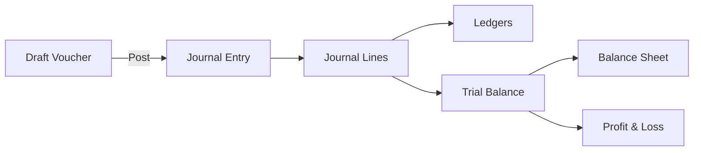

# Accounts Module Developer Documentation

## 1. Overview
The **Accounts Module** implements a double-entry bookkeeping system. It is designed to be the financial core of the ERP, integrating with Sales (Quotations), Purchases, and Inventory.

## 2. Architecture

### Core Concepts
*   **Double-Entry**: Every transaction must have balanced Debits and Credits.
*   **Immutability**: Once a voucher is **Posted**, it converts to a **Journal Entry** which is immutable.
*   **Derivation**: All financial reports (Ledgers, Trial Balance, P&L, Balance Sheet) are derived dynamically from `JournalEntryLine` records.

### Data Flow

## 3. Data Models (`prisma/schema.prisma`)

| Model | Description | Key Fields |
| :--- | :--- | :--- |
| **ChartOfAccount** | The master list of accounts. | `code`, `name`, `type` (ASSET, LIABILITY, etc.) |
| **Voucher** | A transaction container (Draft state). | `type`, `status` (draft/posted), `lines` |
| **VoucherLine** | Individual debit/credit lines for specific accounts. | `debitAmount`, `creditAmount`, `chartOfAccountId` |
| **JournalEntry** | The posted, immutable transaction record. | `entryNumber`, `date` |
| **JournalEntryLine** | The source of truth for all reporting. | `debitAmount`, `creditAmount`, `chartOfAccountId` |

## 4. Server Actions & Logic

### Vouchers
*   **File**: `app/(dashboard)/dashboard/accounts/vouchers/_actions/voucher.action.tsx`
*   **`createVoucher`**: Creates a draft. Validates that `Total Debits == Total Credits`.
*   **`postVoucher`**:
    1.  Verifies the voucher is in `draft` status.
    2.  Creates a corresponding `JournalEntry`.
    3.  Copies all `VoucherLine` items to `JournalEntryLine`.
    4.  Updates Voucher status to `posted`.
    5.  Executes inside a Prisma Transaction.

### Reports
All reports are generated on-the-fly via server actions in `app/(dashboard)/dashboard/accounts/reports/_actions/`.

*   **Trial Balance**: Aggregates `sum(debit) - sum(credit)` for every account.
*   **Balance Sheet**: Filters for ASSET, LIABILITY, EQUITY. Calculates `Assets = Liabilities + Equity`.
*   **Profit & Loss**: Filters for REVENUE, EXPENSE. Calculates `Net Income = Revenue - Expense`.

## 5. Integrations

### Purchase Integration
*   **Trigger**: When a Purchase Order is marked `RECEIVED`.
*   **Action**: Automatically creates and posts a **PURCHASE** voucher.
*   **Debit**: Inventory Asset.
*   **Credit**: Accounts Payable.

### Sales Integration
*   **Trigger**: When a Quotation/Sales Order is `ACCEPTED` (or Invoice generated).
*   **Action**: Automatically creates and posts a **SALES** voucher.
*   **Debit**: Accounts Receivable.
*   **Credit**: Sales Revenue.

## 6. Security & Permissions
*   Access is controlled via the `hasPermission` utility.
*   **Keys**: `accounts.vouchers`, `accounts.ledgers`, `accounts.reports`.
*   **Operations**: `view`, `create`, `approve` (for posting).
