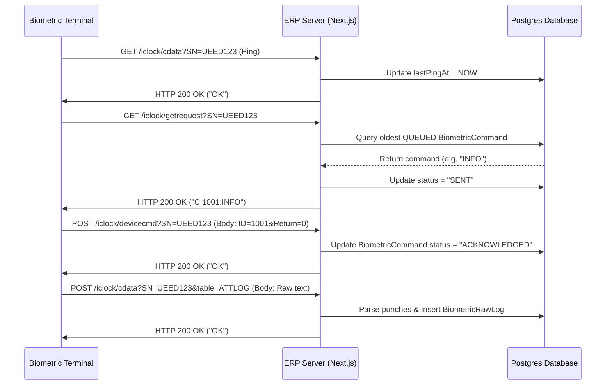

# ZKTeco ADMS Cloud Sync Reference Manual

This document provides a technical overview of the ZKTeco ADMS (Automatic Data Master Server) protocol implementation in this ERP application. It serves as a guide for developers to understand the direct cloud sync architecture and details how to reactivate it in the future.

---

## 1. How ZKTeco ADMS Protocol Works

Unlike standard polling protocols where the server initiates contact, **ZKTeco ADMS devices act as HTTP clients** that periodically initiate requests to the server. The server acts as a passive responder.

The communication cycle is divided into three endpoints:
1. **Command Polling (`/iclock/getrequest`)**: The device asks: *"Do you have any commands for me?"*
2. **Command Acknowledgment (`/iclock/devicecmd`)**: The device says: *"I executed command X. Here is the return status code."*
3. **Data Push (`/iclock/cdata`)**: The device says: *"Here are the raw user logs, fingerprints, or punch events that occurred."*

---

## 2. ERP Routing & Endpoint Architecture

The following endpoints are mapped under `app/iclock/`:

### 1. `/iclock/getrequest` (GET)
* **Description**: Consumes the command queue. It checks the `BiometricCommand` table for commands in the `QUEUED` state corresponding to the device serial number (`SN`).
* **Format**: Returns `OK` if no commands are pending, or `C:<commandId>:<commandText>` to instruct the device.
* **Safety Rules**: 
  - Prevents dangerous commands containing keywords like `CLEAR`, `DELETE`, `REBOOT` or `FACTORY RESET`.
  - Automatically times out commands that have been in the `SENT` state for more than 5 minutes without an acknowledgment.

### 2. `/iclock/devicecmd` (POST)
* **Description**: Receives execution status feedback from the device.
* **Format**: Reads the POST request body text (e.g. `ID=1719234812&Return=0&CMD=INFO`).
* **Processing**: Looks up the command in `BiometricCommand` using `admsCommandId` (stored inside `payloadJson`). Updates the command status to `ACKNOWLEDGED` (on `Return=0`) or `FAILED`.

### 3. `/iclock/cdata` (GET/POST)
* **GET**: Handles basic device initialization handshakes (returns `OK` plain text).
* **POST**: Receives raw log pushes. The query parameter `table` specifies the log type (e.g., `ATTLOG` for scans, `OPERLOG` for device operation audits).
  - **Data Ingestion**: Raw data is tab-separated:
    `EnrollNumber \t Date YYYY-MM-DD \t Time HH:MM:SS \t PunchType \t VerifyMode \t WorkCode \n`
  - **Parser**: Split by `\n` and `\t`, validated against date regular expressions, stored inside the `BiometricRawLog` table, and then sent to `syncBiometricLogs` for processing.

---

## 3. Reactivation Plan (Reverting Suspension)

To restore direct cloud sync capabilities, you simply need to restore the route handlers under `app/iclock/` to their original implementation. 

### Step 1: Restore Endpoint Files
The original implementations of these files were backed up prior to suspension. You can recover them by checking out the code from version control or restoring the original functions:

1. **`app/iclock/cdata/route.ts`**:
   - Re-enable the body parsing loop (`rawText.split('\n')`).
   - Re-enable the `BiometricRawLog` creation and `syncBiometricLogs` execution call.
2. **`app/iclock/devicecmd/route.ts`**:
   - Re-enable command status updates to `ACKNOWLEDGED` or `FAILED` in the database.
   - Re-enable the automatic `EmployeeDeviceMap` state updates when sync commands return code `0`.
3. **`app/iclock/getrequest/route.ts`**:
   - Re-enable the database queries to the `BiometricCommand` table.
   - Re-enable command timeout resolution and command dispatches.

### Step 2: Set Devices Mode
In the ERP Admin Settings dashboard, ensure target devices are updated to:
- **Connection Mode**: `"ADMS"`
- **Status**: `"active"`

### Step 3: Configure Device Server Address
On the physical ZKTeco device menu:
1. Navigate to **Comm. Settings** $\rightarrow$ **Cloud Server Settings** (or **ADMS Settings**).
2. Set **Server Address** to your public domain name/IP (e.g., `https://your-erp-domain.com`).
3. Set **Server Port** to `443` (if SSL) or `80` (if non-SSL). Next.js middleware routing will forward requests to the `/iclock/` endpoints.
