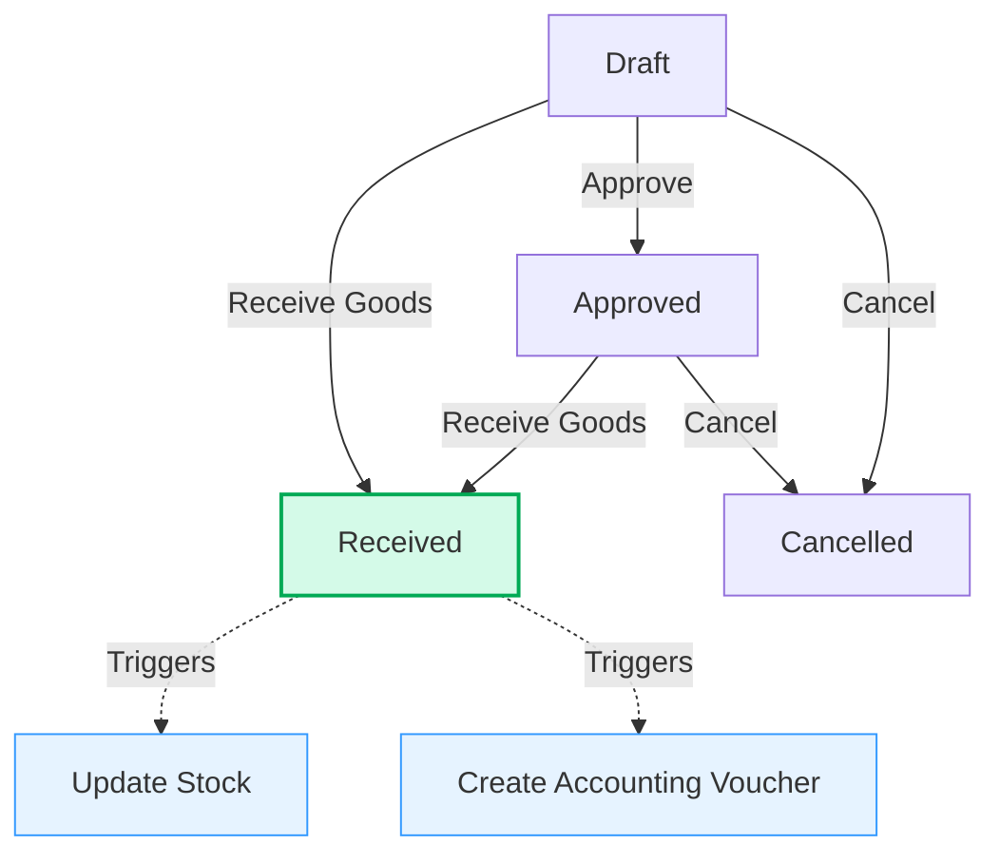

# Purchase Module Documentation

## Overview
The **Purchase Module** manages the procurement lifecycle of items (Raw Materials, Finished Goods, Retail Items) from suppliers. It handles the end-to-end process from order creation to inventory receipt and accounting integration.

## 1. Data Models (`prisma/schema.prisma`)

The module relies on the following core entities:

| Model | Description | Key Relations |
| :--- | :--- | :--- |
| **Purchase** | The main document header. | `supplier`, `warehouse`, `items`, `voucher` |
| **PurchaseItem** | Line items for the purchase. | `item`, `purchase` |
| **Stock** | Current stock quantity per item/warehouse. | `item`, `warehouse` |
| **StockLedger** | Audit trail of stock movements. | `item`, `warehouse`, `reference` |
| **Voucher** | Accounting Journal Entry. | `lines`, `purchase` |

### Key Fields (Purchase)
*   **`status`**: Enum (`DRAFT`, `APPROVED`, `RECEIVED`, `CANCELLED`)
*   **`warehouseId`**: The specific warehouse where stock will be received.
*   **`voucherId`**: Link to the generated accounting voucher (present only after receipt).

## 2. Workflow & Status Transitions

The purchase lifecycle follows a strict status transition flow to ensure data integrity.

### Transition Logic

| From | To | Button Action | Side Effects |
| :--- | :--- | :--- | :--- |
| **DRAFT** | **APPROVED** | "Approve Purchase" | Status update only. |
| **APPROVED** | **RECEIVED** | "Receive Goods" | **Updates Stock** (Increase) **Creates Journal Voucher** (Dr Inventory / Cr Payable) |
| **RECEIVED** | *N/A* | *None* | Record becomes **immutable** (cannot edit/delete). |

## 3. Technical Implementation

### Backend Logic
*   **File**: `app/(dashboard)/dashboard/purchases/_actions/purchase.action.tsx`
*   **Key Functions**:
    *   `createPurchase`: Handles creation. If created directly as "RECEIVED", triggers stock/account logic.
    *   `updatePurchase`: Handles status updates. Contains the transaction block for receipt logic.
    *   `validatePurchaseAccounts`: Pre-check to ensure accounting settings are valid before receipt.
    *   `createPurchaseAccountingVoucher`: Generates the double-entry journal (Debit Inventory, Credit Payable).

### Frontend Components
*   **`purchaseForm.tsx`**:
    *   Uses **React Hook Form** + **Zod** for validation.
    *   Uses **Redux** (`purchaseSlice`) for calculating totals (Subtotal, Tax, Discount) in real-time to avoid prop-drilling issues with large item lists.
*   **`[id]/view/page.tsx`**:
    *   Read-only view.
    *   Uses `PurchaseStatusActions` component to render authorized status transition buttons.

## 4. Accounting & Stock Integration

When a purchase enters the **RECEIVED** state, the system executes a Prisma Transaction to ensure atomicity:

1.  **Stock Update**:
    *   Existing `Stock` record for `(itemId, warehouseId)` is updated (incremented).
    *   A `StockLedger` entry is created with `type: IN` and `reference: PURCHASE`.

2.  **Accounting Voucher**:
    *   **Debit**: Inventory Account
        *   *Raw Materials*: Uses `production.consumptionRawMaterialInventoryId` (from Settings).
        *   *Retail/FG*: Uses `purchase.inventoryAccountId` (from Settings).
    *   **Credit**: Accounts Payable
        *   Uses the Supplier's linked `chartOfAccountId`.
        *   *Fallback*: Uses `purchase.payableAccountId` (from Settings).

## 5. Configuration Requirements

For the "Receive" action to succeed, the **Settings** must be configured:

1.  **Inventory Account**: A default Asset account for inventory must be selected.
2.  **Supplier Ledger**:
    *   Ideally, every Supplier should have a linked Ledger Account (Liability).
    *   OR, a default "Accounts Payable" account must be set in Global Settings.

## 6. Access Control (RBAC)
*   **Permissions**: Checked via `auth()` session.
*   **Restrictions**:
    *   Only authorized users can "Approve" (future enhancement).
    *   "Receive" action creates financial records, so it requires write access to Purchases.
