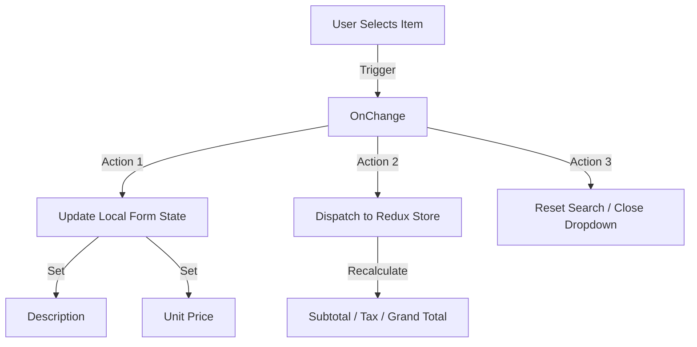

# Item Selection Logic & UX Documentation

## Overview
The item selection mechanism in the Purchase Form is designed to be efficient, preventing duplicate entries while providing quick access to item details. It combines **Client-side Filtering**, **Dynamic Search**, and **Auto-fill** capabilities.

## 1. Logic Conditions

### A. Duplicate Prevention (Filtering)
To prevent users from adding the same item twice in a single purchase order, the dropdown list is dynamically filtered.

*   **Condition**: An item is removed from the dropdown options if it is already selected in *another* row.
*   **Mechanism**:
    1.  The system watches the `items` array in the form state.
    2.  It creates a list of `selectedItemIds` (excluding the current row).
    3.  It filters the global `items` list to create `availableItems` for the current dropdown.
*   **Result**: If you select "Item A" in Row 1, "Item A" will disappear from the options in Row 2.

### B. Search Functionality
*   **Scope**: Searches through both **Item Code** and **Item Description**.
*   **Matching**: Case-insensitive substring match.
*   **State**: Search state is local to the component (`itemSearch`) and resets when a selection is made or the dropdown closes.

## 2. UI/UX Operations

### A. Auto-Fill Actions
When a user selects an item, the following fields are automatically populated to save time and reduce errors:
*   **Description**: Fetched from the master item record.
*   **Unit Price**: Defaults to the item's `costPrice` (Purchase Price).
*   **Amount**: Automatically calculated (`Quantity * Unit Price`).
*   **Stock Display**: The dropdown shows current stock levels to aid decision-making.

### B. Keyboard Accessibility
The custom search input inside the `Select` component handles keyboard events carefully to ensure standard behavior works:
*   **Typing**: Captures keystrokes for the search filter.
*   **Navigation**: Events for `ArrowUp`, `ArrowDown`, `Enter`, and `Escape` are passed through to the parent `Select` component, allowing users to navigate options and select without leaving the keyboard.

### C. Focus Management
*   **Auto-Focus**: When the "Add Item" button is clicked, or when opening a dropdown, the focus is automatically set to the search input field, allowing immediate typing.

## 3. Data Flow

## 4. Edge Cases
*   **No Items Found**: Displays a "No items found" message if the search yields no results.
*   **All Items Selected**: If every available item is already added to the form, the dropdown will show "All items already selected".
