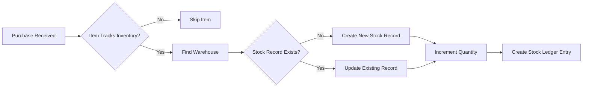
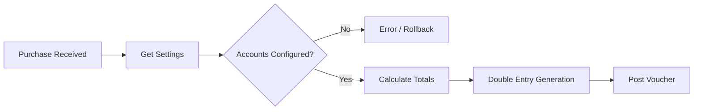

# Stock and Accounts Flow Guideline

## Overview
This document explains how the **Purchase Module** interacts with the **Inventory (Stock)** and **Accounting** systems. The integration is event-driven, triggered specifically when a purchase order is marked as **RECEIVED**.

## 1. Purchase Operations & Triggers

### A. Create / Update (Draft & Approved)
*   **Action**: Creating a purchase in `DRAFT` or updating it to `APPROVED`.
*   **Impact**:
    *   Creates/Updates the `Purchase` record in the database.
    *   **No Stock Impact**: Inventory levels remain unchanged.
    *   **No Accounting Impact**: No financial vouchers are created.

### B. Receive (The Critical Trigger)
*   **Action**: Clicking "Receive Goods" (Updates status to `RECEIVED`).
*   **Impact**: Triggers a **Atomic Transaction** that attempts to:
    1.  Update 100% of the Stock.
    2.  Create the Accounting Voucher.
    3.  Lock the Purchase status.
*   **Safety**: If *any* part fails (e.g., missing account configuration), the *entire* transaction rolls back. No stock is added, and the status reverts to its previous state.

---

## 2. Stock Flow Explanation

The stock update logic resides in `updateStockOnPurchase`.

### Detailed Steps:
1.  **Item Check**: The system iterates through every item in the purchase. It checks if `trackInventory` is enabled for the Item. Services or non-stock items are skipped.
2.  **Warehouse Resolution**: Stock is strictly tied to the `warehouseId` selected in the Purchase.
3.  **Quantity Update**:
    *   **Increment**: The purchase quantity is *added* to the current stock on hand.
4.  **Audit Trail (Stock Ledger)**:
    *   A permanent log entry is created in `StockLedger`.
    *   **Type**: `IN`
    *   **Reference**: `PURCHASE - [Purchase Number]`
    *   **Quantity**: Positive value.

---

## 3. Accounts Flow Explanation

The accounting logic resides in `createPurchaseAccountingVoucher`.

### Double Entry Logic
The system generates a **Journal Voucher** to reflect the increase in assets (inventory) and the increase in liability (payable to supplier).

| Leg | Account Type | Account Source | Explanation |
| :--- | :--- | :--- | :--- |
| **Debit (Dr)** | **Asset** (Inventory) | **Settings** (`inventoryAccountId` or `rawMaterialInventoryId`) | Represents the value of goods entering the company. Increases Inventory Asset. |
| **Credit (Cr)** | **Liability** (Payable) | **Supplier Profile** OR **Settings** (`chartOfAccountId` or `payableAccountId`) | Represents the money owed to the supplier. Increases Accounts Payable. |

### Configuration Dependencies
For this flow to work, the following MUST be configured in **Settings**:
1.  **Inventory Account**: Where the value of stock is held.
2.  **Payable Account**: If the supplier doesn't have a specific ledger linked, the system falls back to the default "Accounts Payable" setting.

---

## 4. Example Scenario

**Scenario**: Purchasing 10 units of "Cotton Fabric" @ $50/unit.
*   **Grand Total**: $500.

**System Actions upon "Receive":**
1.  **Stock**:
    *   Locate "Cotton Fabric" in "Main Warehouse".
    *   Add +10 to Quantity.
    *   Log: "+10 Cotton Fabric (Purchase)" in Ledger.
2.  **Accounts**:
    *   **Debit**: Inventory Asset ($500) -> *Value of stock increases.*
    *   **Credit**: Vendor Payable ($500) -> *Liability to pay increases.*
