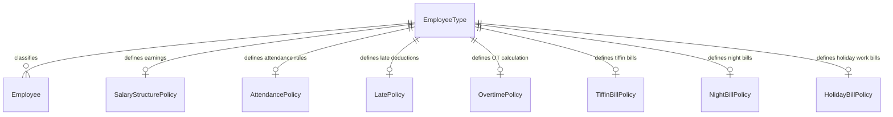

# Developer Documentation: Employee Types & Policy-Based Calculation Rules

This document outlines the design, architecture, and developer guidelines for the dynamic **Employee Types** module and its integration with policy-based calculation rules for Attendance and Payroll.

---

## 1. Architectural Overview

Previously, the employee `type` field was a simple hardcoded string value (`Management`, `Executive`, `Staff`, etc.) on the `Employee` model. 

To enable dynamic payroll and attendance calculations based on employee categories, we have transformed the Employee Type into a first-class database entity (`EmployeeType`). This entity acts as a **Data Warehouse entity / routing hub** that links dynamic employee profiles to specific business calculation policies:



---

## 2. Database Schema Changes

The following schema updates have been applied in [prisma/schema.prisma](file:///Users/manishankarvakta/Desktop/APPS/ffERP/startup-mvp/prisma/schema.prisma):

### 2.1. The `EmployeeType` Hub Model
```prisma
model EmployeeType {
  id                      String                 @id @default(cuid())
  name                    String
  description             String?
  status                  String                 @default("active") // "active" | "inactive"
  isTrash                 Boolean                @default(false)
  createdBy               String
  createdAt               DateTime               @default(now())
  updatedAt               DateTime               @updatedAt
  employees               Employee[]
  creator                 User                   @relation("EmployeeTypeCreator", fields: [createdBy], references: [id])
  
  // Dynamic Policy Mappings
  attendancePolicyId      String?
  attendancePolicy        AttendancePolicy?      @relation(fields: [attendancePolicyId], references: [id])
  latePolicyId            String?
  latePolicy              LatePolicy?            @relation(fields: [latePolicyId], references: [id])
  overtimePolicyId        String?
  overtimePolicy          OvertimePolicy?        @relation(fields: [overtimePolicyId], references: [id])
  tiffinBillPolicyId      String?
  tiffinBillPolicy        TiffinBillPolicy?      @relation(fields: [tiffinBillPolicyId], references: [id])
  nightBillPolicyId       String?
  nightBillPolicy         NightBillPolicy?       @relation(fields: [nightBillPolicyId], references: [id])
  holidayBillPolicyId     String?
  holidayBillPolicy       HolidayBillPolicy?     @relation(fields: [holidayBillPolicyId], references: [id])
  salaryStructurePolicyId String?
  salaryStructurePolicy   SalaryStructurePolicy? @relation(fields: [salaryStructurePolicyId], references: [id])

  @@index([attendancePolicyId])
  @@index([latePolicyId])
  @@index([overtimePolicyId])
  @@index([tiffinBillPolicyId])
  @@index([nightBillPolicyId])
  @@index([holidayBillPolicyId])
  @@index([salaryStructurePolicyId])
}
```

### 2.2. Policy Models Introduced
1. **`SalaryStructurePolicy`**: Defines the split percentages of salary components (e.g. Basic: 55%, House Rent: 26%, Medical: 5%, Transport: 4%, Food: 10% of Gross).
2. **`AttendancePolicy`**: Defines eligibility for attendance bonus (fixed/percentage), and toggles for absent and late penalties.
3. **`LatePolicy`**: Configures late conversion rules (e.g., 3 late days convert to 1 absent day), late counts affecting bonus, and salary deduction settings.
4. **`OvertimePolicy`**: Calculates overtime rates based on shift hours or custom divisors, with basic-to-gross multiplier rules (e.g. 2.0x hourly basic rate).
5. **`TiffinBillPolicy`**: Configures eligibility and rates for tiffin bill allowances when working beyond a shift time.
6. **`NightBillPolicy`**: Configures eligibility and rates for night shift bill allowances.
7. **`HolidayBillPolicy`**: Determines premium salary/fixed rates when working on weekends or public holidays.
8. **`PayrollSetting`**: Stores global payroll configurations such as default monthly working days, pay divisor, and currency rules.

### 2.3. Dynamic Fields in `Attendance` & `PayrollItem`
*   **`Attendance`**: Added columns to store calculated values per punch record: `lateMinutes`, `lateCountValue`, `lateDeductionAmount`, `tiffinBillAmount`, `nightBillAmount`, `holidayBillAmount`, `calculatedOvertimeAmount`, and `policyCalculationNote`.
*   **`PayrollItem`**: Added columns to store monthly aggregated results: `tiffinAllowance`, `nightAllowance`, `holidayAllowance`, `otherAllowance`, `lateDeduction`, and `otherDeduction`.

---

## 3. UI/UX Structure (Standalone Module)

Unlike global system settings, **Employee Types Setup** has been introduced as a standalone module located under:
👉 **Route Path**: `/dashboard/employees/types`

### 3.1. Main Page (`page.tsx`)
Located at [types/page.tsx](file:///Users/manishankarvakta/Desktop/APPS/ffERP/startup-mvp/app/(dashboard)/dashboard/employees/types/page.tsx), it acts as the primary controller:
*   Checks permissions on the server (`peoples.employees`) for view/edit access.
*   Queries types from `getEmployeeTypes` action.
*   Renders `<EmployeeTypeForm>` directly if `action=create` or `action=edit` query params are present.
*   Renders `<EmployeeTypesList>` with Tabs ("All Types", "Trash") for listing, filtering, and bulk trashing/restoration.

### 3.2. List View (`employee-types-list.tsx`)
Features a data table with:
*   Keyword searching.
*   Status filtering (Active, Inactive, Trash).
*   Pagination controls.
*   Checkbox selectors and a **Bulk Actions** dropdown (Activate, Deactivate, Move to Trash, Restore).
*   Active employee guards: Blocks deletion of any type currently assigned to active employees.

---

## 4. Seeding and Migrations

To transition successfully from the legacy hardcoded setup to the new database-driven model:

### 4.1. Legacy Seeding
We created a seeding script at [prisma/seed-employee-types.ts](file:///Users/manishankarvakta/Desktop/APPS/ffERP/startup-mvp/prisma/seed-employee-types.ts) to seed the 5 legacy categories:
*   Management
*   Executive
*   Staff
*   Manager
*   Sales Assistant

Run this seed command:
```bash
npx tsx prisma/seed-employee-types.ts
```

### 4.2. Database Schema Migrations
Whenever schema changes occur, synchronize the DB:
```bash
# Push directly in dev/testing:
npx prisma db push

# Generate migration in production environments:
npx prisma migrate dev --name add_employee_types_and_policies
```

---

## 5. Backward Compatibility Guard

To prevent breaking existing modules, reports, or payroll calculation routines that query `employee.type` directly as a string, we implemented a transaction-level sync guard:

1. **Server Actions Guard**: In [employee.action.tsx](file:///Users/manishankarvakta/Desktop/APPS/ffERP/startup-mvp/app/(dashboard)/dashboard/employees/_actions/employee.action.tsx), when `employeeTypeId` is provided during create/update:
   *   The server action queries the corresponding `EmployeeType` name.
   *   It writes the type name string directly to the legacy `type` field and links `employeeTypeId` in the database transaction.
2. **Form Auto-Matching**: In [employeeForm.tsx](file:///Users/manishankarvakta/Desktop/APPS/ffERP/startup-mvp/app/(dashboard)/dashboard/employees/_components/employeeForm.tsx), when editing a legacy employee record with a string `type` but no `employeeTypeId`:
   *   The page automatically fetches the dynamic active types.
   *   It matches the legacy string name to the new ID case-insensitively and updates the form state dynamically.
