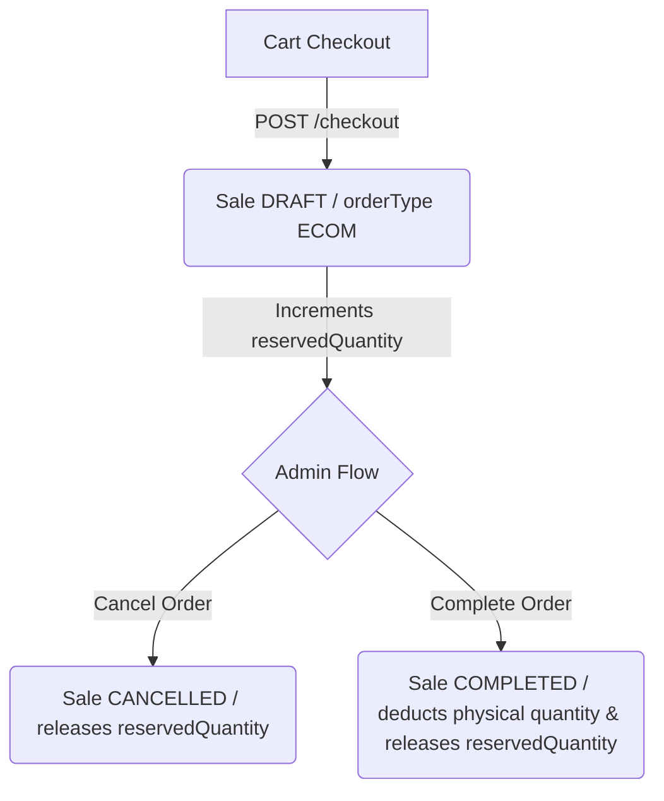

# FF-ERP E-commerce Public API Documentation

This document describes the e-commerce public API integration designed for client/storefront applications to communicate securely with the FF-ERP backend.

---

## Base URL

```txt
http://your-erp-domain.com/api/ecommerce
```

---

## Authentication

The e-commerce client APIs authenticate customer transactions separately from admin user auth. 

### Supported Authentication Methods

1. **Bearer Token (Authorization Header)**
   ```http
   Authorization: Bearer <JWT_TOKEN>
   ```

2. **HTTP-Only Session Cookie**
   * Cookie Name: `ecom_client_token`
   * Attributes: `HttpOnly`, `SameSite=Lax` (or `Strict`), `Secure` (in production).

---

## API Inventory

### 1. Authentication APIs

#### Register Customer
* **Endpoint**: `POST /api/ecommerce/auth/register`
* **Auth Required**: No
* **Request Body**:
  ```json
  {
    "phone": "01700000001",
    "password": "securepassword123",
    "name": "John Doe",
    "email": "john@example.com"
  }
  ```
* **Response**:
  ```json
  {
    "success": true,
    "message": "Registration successful",
    "client": {
      "id": "client_cuid",
      "phone": "01700000001",
      "name": "John Doe",
      "email": "john@example.com",
      "isLoginEnabled": true
    }
  }
  ```

#### Login Customer
* **Endpoint**: `POST /api/ecommerce/auth/login`
* **Auth Required**: No
* **Request Body**:
  ```json
  {
    "phone": "01700000001",
    "password": "securepassword123"
  }
  ```
* **Response**: Sets the `ecom_client_token` cookie and returns:
  ```json
  {
    "success": true,
    "message": "Login successful",
    "token": "JWT_TOKEN_HERE"
  }
  ```

#### Get Current Profile
* **Endpoint**: `GET /api/ecommerce/auth/me` or `GET /api/ecommerce/client/profile`
* **Auth Required**: Yes
* **Response**:
  ```json
  {
    "success": true,
    "client": {
      "id": "client_cuid",
      "name": "John Doe",
      "phone": "01700000001",
      "email": "john@example.com",
      "clientType": "regular"
    }
  }
  ```

#### Logout Customer
* **Endpoint**: `POST /api/ecommerce/auth/logout`
* **Auth Required**: No (clears cookies)
* **Response**:
  ```json
  {
    "success": true,
    "message": "Logged out successfully"
  }
  ```

---

### 2. Shipping Address APIs

#### List Addresses
* **Endpoint**: `GET /api/ecommerce/client/addresses`
* **Auth Required**: Yes

#### Create Address
* **Endpoint**: `POST /api/ecommerce/client/addresses`
* **Auth Required**: Yes
* **Request Body**:
  ```json
  {
    "recipientName": "John Doe",
    "phone": "01700000001",
    "addressLine": "House 1, Road 2",
    "area": "Dhanmondi",
    "city": "Dhaka",
    "district": "Dhaka",
    "division": "Dhaka",
    "country": "Bangladesh",
    "isDefault": true
  }
  ```

#### Set Default Address
* **Endpoint**: `PATCH /api/ecommerce/client/addresses/[id]/default`
* **Auth Required**: Yes

---

### 3. Product Catalog APIs

#### Search/List Products
* **Endpoint**: `GET /api/ecommerce/products`
* **Auth Required**: No
* **Query Parameters**:
  * `page` (default 1)
  * `limit` (default 20)
  * `search` (searches code/name/description)
  * `category` (category slug)
* **Response (DTO Sanitized)**:
  ```json
  {
    "success": true,
    "products": [
      {
        "id": "item_id",
        "code": "P-001",
        "name": "Awesome Product",
        "slug": "awesome-product",
        "salesPrice": 250,
        "featuredImage": "image-url",
        "availableStock": 42,
        "outOfStock": false
      }
    ],
    "pagination": { "page": 1, "limit": 20, "total": 1, "totalPages": 1 }
  }
  ```
  *Note: Catalog APIs never return sensitive columns like `costPrice` or supplier IDs.*

---

### 4. Cart and Coupon Validation APIs

#### Validate Cart
* **Endpoint**: `POST /api/ecommerce/cart/validate`
* **Request Body**:
  ```json
  {
    "items": [
      { "itemId": "item_cuid", "variantId": "variant_cuid", "quantity": 2 }
    ]
  }
  ```

#### Validate Coupon
* **Endpoint**: `POST /api/ecommerce/coupons/validate`
* **Request Body**:
  ```json
  {
    "code": "SUM_2026",
    "items": [
      { "itemId": "item_cuid", "variantId": null, "quantity": 1 }
    ]
  }
  ```

---

### 5. Transactional Checkout API

#### Place Order
* **Endpoint**: `POST /api/ecommerce/checkout`
* **Auth Required**: Yes
* **Request Body**:
  ```json
  {
    "items": [
      { "itemId": "item_id", "variantId": "variant_id", "quantity": 2 }
    ],
    "addressId": "address_cuid",
    "couponCode": "SUM_2026",
    "paymentMethod": "COD",
    "customerNote": "Delivery after 5 PM please."
  }
  ```
* **Response**:
  ```json
  {
    "success": true,
    "message": "Order placed successfully",
    "order": {
      "id": "sale_cuid",
      "saleNumber": "SAL-2026-0070",
      "status": "DRAFT",
      "orderType": "ECOM",
      "deliveryStatus": "PENDING",
      "paymentStatus": "UNPAID",
      "paymentMethod": "COD",
      "subTotal": 200,
      "discount": 10,
      "tax": 0,
      "deliveryCharge": 80,
      "grandTotal": 270,
      "createdAt": "2026-07-01T12:36:04.627Z"
    }
  }
  ```

---

### 6. Order History & Cancellation APIs

#### List Customer Orders
* **Endpoint**: `GET /api/ecommerce/orders`
* **Auth Required**: Yes
* **Query Parameters**: `page`, `limit`, `status`, `deliveryStatus`, `paymentStatus`

#### Get Order Details
* **Endpoint**: `GET /api/ecommerce/orders/[id]`
* **Auth Required**: Yes

#### Cancel Order (Draft Only)
* **Endpoint**: `POST /api/ecommerce/orders/[id]/cancel`
* **Auth Required**: Yes
* **Response**:
  ```json
  {
    "success": true,
    "message": "Order cancelled successfully",
    "order": {
      "id": "sale_cuid",
      "status": "CANCELLED",
      "deliveryStatus": "CANCELLED"
    }
  }
  ```

---

## Order Lifecycle & Stock Allocation



1. **Checkout**: Inserts `Sale` in `DRAFT` status and `ECOM` type. Increments `Stock.reservedQuantity` inside a database transaction (prevents race conditions). Physical stock `Stock.quantity` is unchanged.
2. **Cancellation (Customer/Admin)**: Sets status to `CANCELLED`. Safely decrements `Stock.reservedQuantity` back to its pre-order limit. Physical stock is untouched. No ledger/accounting actions are taken.
3. **Completion (Admin Only)**: Set status to `COMPLETED`. Decrements `Stock.quantity` (physical count) and decrements `Stock.reservedQuantity` (reserved count). Writes a `StockLedger` OUT entry, creates and posts an accounting journal voucher.
