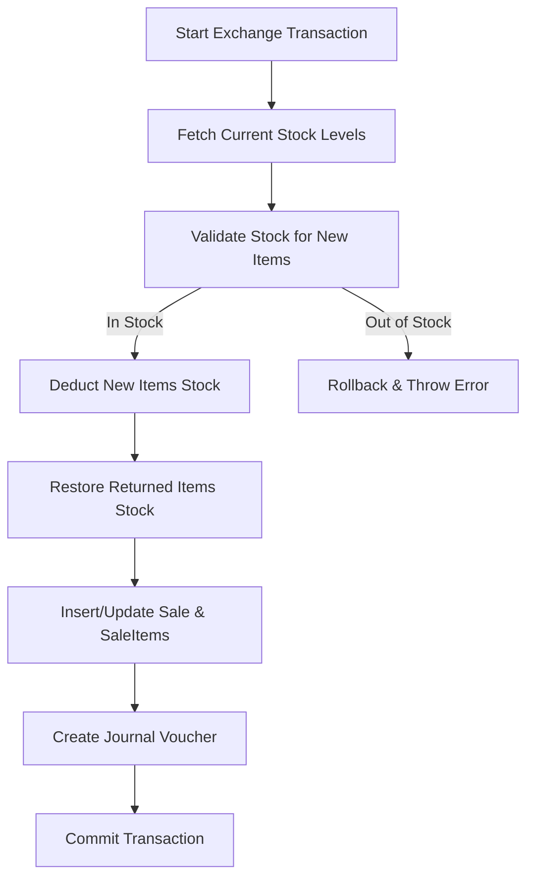

# Sales, Returns, and Exchanges Architecture

This document details the architectural design, database structures, inventory mechanics, and accounting rules for **Sales**, **Sales Returns**, and **Sales Exchanges** within the RafiFashionERP system.

---

## 1. Structural Overview & Document Flows

The application supports three primary transactional states:

1. **Standard POS/Wholesale Sale (`OrderType.RETAIL` or `OrderType.WHOLESALE`)**
   - Customer purchases items.
   - Stock is deducted from the selected Warehouse.
   - Cash/Receivable is debited; Sales Revenue is credited.

2. **Sales Return (`OrderType.RETURN`)**
   - Customer returns previously purchased items.
   - Stock is restored to the selected Warehouse.
   - Cash/Receivable is refunded (credited); Sales Revenue is reduced (debited).

3. **Product Exchange (`OrderType.EXCHANGE`)**
   - Customer returns old items and purchases new items in a **single transaction**.
   - Net transaction totals are calculated: `Net Payable = (New Items Subtotal) - (Returned Items Subtotal)`.
   - Inventory for returned items is restored, and inventory for new items is deducted.
   - A single cohesive double-entry accounting voucher is posted for the net difference.

---

## 2. Database Schema Details

### Models Impacted

* **`Sale`**: Tracks the overall header details.
  - `orderType`: Enum `OrderType` (`RETAIL`, `WHOLESALE`, `RETURN`, `EXCHANGE`).
  - `status`: Transaction status (`COMPLETED`, `VOIDED`, `DRAFT`, etc.).
  - `paymentDetails`: JSON blob storing payment breakdown (cash/card/mfs amounts, account IDs, and client due allocations).

* **`SaleItem`**: Individual line items.
  - `isReturnItem`: Boolean field indicating if the line item represents a returned product (useful for `EXCHANGE` type sales).
  - `quantity`: Positive for sold items; negative or processed as absolute value with logic flags for returns.

---

## 3. Double-Entry Accounting & Ledger Rules

Each transaction maps to a specific double-entry journal template, resolved dynamically using the outlet's configured Accounts Chart.

### A. Standard Sale
* **Debit**: Cash (Cash/Bank/MFS) or Accounts Receivable (if client is credited).
* **Credit**: Sales Revenue.
* **Credit**: VAT Payable (if tax is enabled).

### B. Sales Return
* **Debit**: Sales Returns & Allowances (or debit Sales Revenue).
* **Debit**: VAT Payable (reversal of tax).
* **Credit**: Cash (Refunded) or Accounts Receivable (if deducting customer outstanding due).

### C. Exchange (Net Positive: Customer pays additional amount)
* **Debit**: Cash / Accounts Receivable (for the net difference).
* **Debit**: Sales Returns & Allowances (for the value of returned items).
* **Credit**: Sales Revenue (for the value of new items).
* **Credit**: VAT Payable (for the net tax difference).

### D. Exchange (Net Negative: Cash Refund/Credit to Customer)
* **Debit**: Sales Returns & Allowances (for the value of returned items).
* **Credit**: Sales Revenue (for the value of new items).
* **Credit**: Cash (Refunded) or Accounts Receivable (credited to customer profile).
* **Credit**: VAT Payable (for the net tax difference).

---

## 4. Inventory Stock Controls

To maintain data integrity and prevent race conditions, all database updates are wrapped in a **single Prisma transaction (`prisma.$transaction`)**.

### Stock Restores vs Deductions

* **Returned Items**: Restored to the active warehouse.
  `StockLevel.quantity = StockLevel.quantity + returnQty`
* **New Items**: Deducted from the active warehouse.
  `StockLevel.quantity = StockLevel.quantity - newQty`
* **Negative Stock Prevention**: Unless `allowNegativeSale` is active in settings, the transaction throws a validation error if stock drops below zero for any new item.

---

## 5. UI Elements & Flow Orchestration

### POS Component Interface
- **State Indicators**: `isExchangeMode` (boolean) changes the POS theme and activates dual-calculations.
- **Cart Segregation**: Cart entries are divided into returns and new items based on `isReturnItem`. Return items display negative values and subtract from order totals.
- **Invoice Lookup**: Under By Invoice or By Customer modes, past purchases are loaded. Users select returned quantities and click "Add to Exchange Cart" to prepopulate the active cart.

### Receipts & Printing
- Invoices are formatted to render two distinct sections: **Purchased Items** and **Returned Items**.
- Shows outstanding customer dues (`Previous Outstanding Due` and `Total Due Balance`) to keep customers informed of credit limits and due balances.
